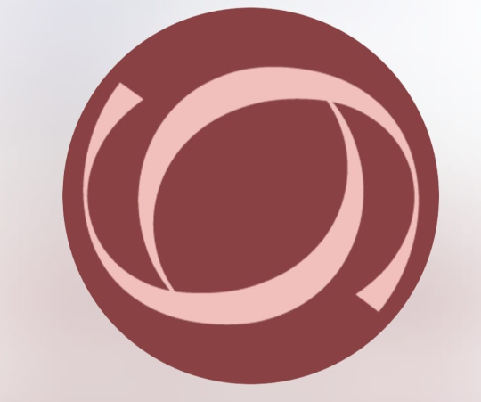

<h1 align="center">
  <br/>
  
  <br/>
  Gabelia Beauty Studio — CRM
</h1>

<p align="center">
  Sistema de gestão completo para clínicas e studios de estética
</p>

<p align="center">
  
  
  
  
  
</p>

---

## ✨ Sobre o projeto

O **Gabelia CRM** é uma aplicação web para gestão de clínicas de estética.
Desenvolvido com foco em simplicidade, ele centraliza clientes, agendamentos, atendimentos e financeiro em um único painel — sem precisar de banco de dados externo.
Todos os dados são persistidos localmente via `localStorage`, com sincronização em tempo real entre as páginas via eventos customizados do browser.

---

## 🖥️ Preview

| Dashboard | Agenda | Financeiro |
|---|---|---|
| Visão geral do dia com métricas, retornos e heatmap de horários | Calendário visual com agendamentos por cor e profissional | Lançamentos, taxas por método de pagamento e parcelas |

---

## 🚀 Stack

| Tecnologia | Versão | Função |
|---|---|---|
| [Next.js](https://nextjs.org) | 16.2.3 | Framework React (App Router + Turbopack) |
| React | 19 | UI reativa |
| TypeScript | 5 | Tipagem estática em toda a aplicação |
| TailwindCSS | 4 | Design system / utilitários CSS |
| [lucide-react](https://lucide.dev) | 1.8+ | Ícones SVG |
| Manrope + Inter | — | Tipografia (Google Fonts) |

---

## 📦 Módulos

### 🏠 Dashboard (`/`)
- Saudação dinâmica por horário do dia
- KPIs: clientes únicos, agendados, realizados e cancelados
- Agenda do dia / semana com toggle interativo
- Histórico recente de atendimentos
- **Retornos previstos** com indicador de urgência (alto/médio/baixo)
- **Aniversariantes da semana** com atalho direto para WhatsApp
- **Heatmap** de horários mais movimentados (normalizado 0–4)

### 👤 Clientes (`/clientes`, `/clientes/[id]`)
- Listagem com busca e filtros
- Perfil individual com histórico de procedimentos

### 📅 Agenda (`/agenda`)
- Calendário visual com eventos coloridos por categoria
- Mini-calendário lateral para navegação rápida
- Painel de detalhes com status, profissional e procedimento

### 📋 Atendimentos (`/atendimentos`, `/atendimentos/novo`)
- Listagem completa de atendimentos com filtros por status
- Formulário de novo agendamento

### 💰 Financeiro (`/financeiro`)
- Lançamentos de entrada e saída com categorias
- Registro de pagamentos com cálculo automático de taxas:
  - Dinheiro: 0%
  - PIX: 0,99%
  - Débito: 1,99%
  - Crédito: variável por nº de parcelas (PagSeguro)
- Comanda por atendimento
- Projeção de parcelas a receber por mês

### ⚙️ Configurações (`/configuracoes`)
- Edição do perfil da profissional
- Dados sincronizados em tempo real com a sidebar

---

## ⚙️ Rodando localmente

### Pré-requisitos
- Node.js 18+
- npm

### Instalação

```bash
# Clone o repositório
git clone https://github.com/Loohfranca/sistema-de-crm.git
cd sistema-de-crm

# Instale as dependências
npm install
```

### Desenvolvimento

```bash
npm run dev
```

Acesse: **http://localhost:3003**

### Build de produção

```bash
npm run build
npm run start
```

---

## 🗂️ Estrutura do projeto

```
src/
├── app/                        # Rotas (App Router)
│   ├── page.tsx                # Dashboard
│   ├── agenda/
│   ├── atendimentos/
│   │   └── novo/
│   ├── clientes/
│   │   └── [id]/
│   ├── configuracoes/
│   ├── financeiro/
│   ├── globals.css             # Design tokens globais
│   └── layout.tsx              # Layout raiz + Sidebar
│
├── components/                 # Componentes reutilizáveis
│   ├── sidebar.tsx
│   ├── agenda/
│   │   ├── event-card.tsx
│   │   ├── mini-calendar.tsx
│   │   └── side-panel.tsx
│   └── financeiro/
│       ├── comanda-modal.tsx
│       ├── confirm-modal.tsx
│       ├── financeiro-summary.tsx
│       ├── financeiro-table.tsx
│       └── lancamento-modal.tsx
│
├── lib/                        # Lógica e persistência
│   ├── store.ts                # Fonte única de dados (agendamentos)
│   ├── financeiro.ts           # Módulo financeiro isolado
│   ├── financeiro-taxas.ts     # Tabela de taxas por método
│   ├── agenda-config.ts        # Configurações de status/cores
│   ├── clientes.ts             # Dados de clientes
│   └── servicos.ts             # Catálogo de serviços
│
└── types/                      # Definições TypeScript
    ├── financeiro.ts
    └── servico.ts
```

---

## 🔑 Chaves do localStorage

| Chave | Conteúdo |
|---|---|
| `crm_agenda_v5` | Lista de agendamentos (fonte principal) |
| `crm_lancamentos_v1` | Lançamentos financeiros manuais |
| `crm_perfil` | Perfil da profissional (nome, especialidade) |

> Os dados são inicializados automaticamente com exemplos na primeira execução.

---

## 📡 Deploy

O projeto está publicado na **Vercel** com deploy contínuo a partir da branch `main`.

```
Repositório: github.com/Loohfranca/sistema-de-crm
Branch:      main
Framework:   Next.js (detectado automaticamente)
```

---

## 📄 Licença

Projeto privado — Gabelia Beauty Studio © 2025
